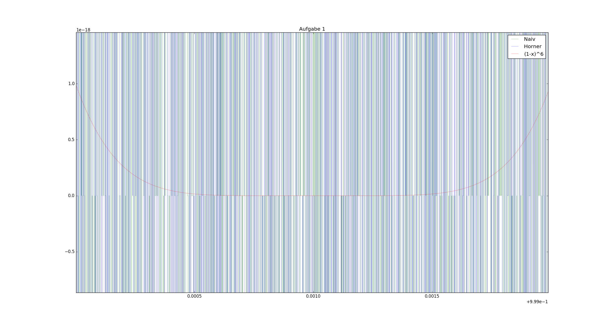
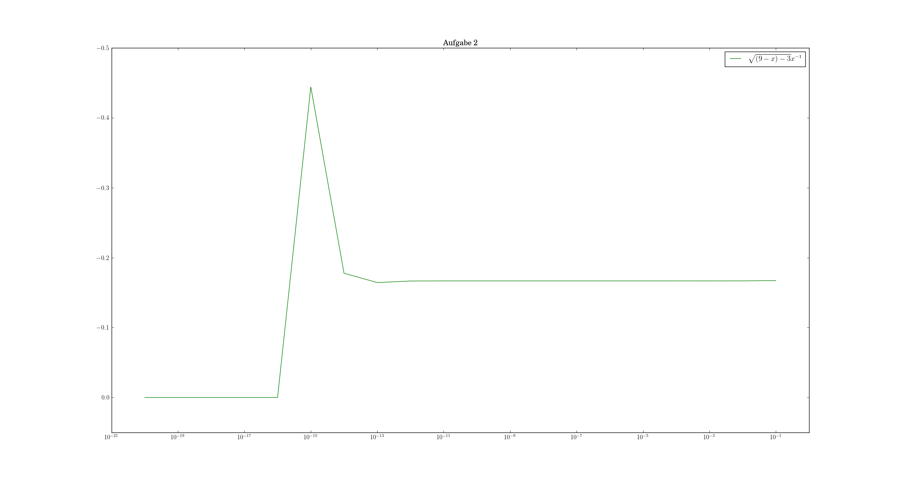
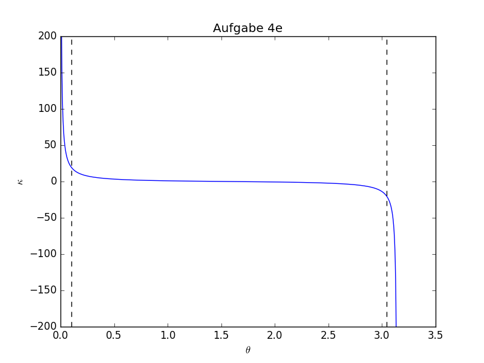

# Blatt 0
Jean-Marco Alameddine, Johannes Kollek, Max Pernklau

## Aufgabe 1

*a)* ist am genausten, da $(1-x)^6$ numerisch stabiler ist (eine Addition, sonst nur Multiplikationen). *b)* ist am schlechtesten konditioniert, da maximal oft addiert wird. *c)* liegt dazwischen, nahe Null treten trotzdem Probleme auf.

## Aufgabe 2
### a)
Nach *L'Hôpital* ergibt sich der Grenzwert zu $-1/6$.

### b)

Ab $<10^{-15}$ ist die `double`-Genauigkeit unterschritten; die Größenordnungen von 9 und $10^{-16}$ im Radikanten unterscheiden sich zu stark.

Davor treten Rundungsfehler beim Wurzelziehen auf, dies erklärt den *"Peak"* bei $10^{-15}$.

## Aufgabe 3
### a)

Analytisch ergibt sich $f(x)=2/3 \: \forall x$.  
Eine $\leq 1\%$-ge Abweichung ergibt sich für $x \in  [ -4\cdot 10^4,4\cdot 10^4]$.  
Es ist grob 0 für $|x| \geq 2\cdot 10^5$. 

### b)

Analytisch ergibt sich $g(x)=2/3 \: \forall x$.  
Eine $\leq 1\%$-ge Abweichung ergibt sich für $|x| \geq 5\cdot 10^{-5}$.  
Es ist grob 0 für $|x| \leq 8\cdot 10^{-6}$. 

## Aufgabe 4
### a)
Nein, denn der Nenner $1 - \beta^2 \cos^2(\theta)$ ist für $\theta$ Vielfaches von $\pi$ 0 und damit ist die Formel instabil. 

### b)
Der Term
$1 - \beta^2  \cos^2(\theta)$
lässt sich immerhin umformen zu
$1/\gamma^2 + \beta^2  \sin^2(\theta)$.
Dieser sollte keine Instabilität an den gegebenen Stellen mehr aufweisen, siehe Teilaufgabe *c)*.

### c)

### d)
Die Ableitung ergibt 
\begin{align*}
\frac{\alpha^2}{s} \frac{ (1-3\beta^2) \sin{2\theta} }{(b^2 \cos{\theta}^2 -1)^2} \; .  
\end{align*}
Die Konditionszahl errechnet sich nach $(f'/f) \theta$ und dementsprechend zu 
\begin{align*}
\frac{(1-3 \beta^3) \sin{2\theta} }{(b^2 \cos{\theta}^2 -1) ( 2+\sin{\theta}^2)}\; .
\end{align*}

### e)

Die Konditionszahl ist in Abhängigkeit von $\theta$ hier abgebildet. Um die Bereiche 0 und $2 \pi$ ergibt sich eine schlechte Konditionierung, mit schwarzen Balken in etwa gekennzeichnet. Dazwischen hat man eine gute Konditionierung.

# PS
Es tut uns Leid. Das nächste mal machen wir es einheitlich, lesbar und mit einem makefile.
