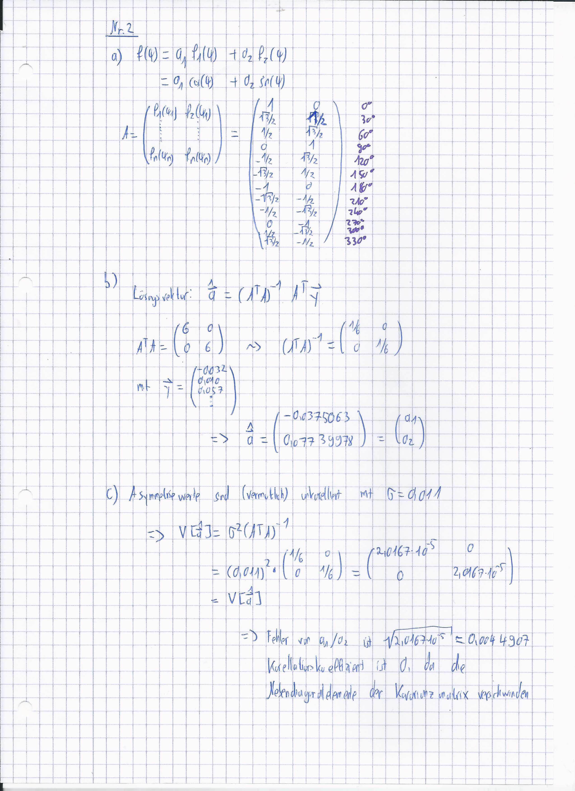
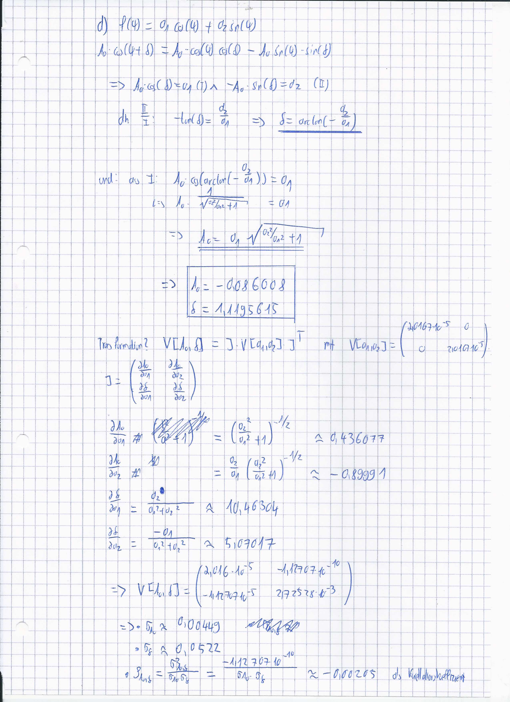

#Aufgabe 1
##a)

Die Likelihoodfunktion ergibt sich zu
\begin{align*}
  L = \prod_{n_i} \frac{\lambda^{n_i}}{n_i!}e^{-\lambda},
\end{align*}
wobei
\begin{align*}
  n_i = \{13,8,9\}
\end{align*}
annehmen kann. Aus der Likelihoodfunktion folgt schließlich
\begin{align*}
  -\ln (L) &= - \sum_{n_i} \ln \left( \frac{\lambda^{n_i}}{n_i!} e^{-\lambda} \right) \\
         &= 3\lambda - \ln \left( \frac{\lambda^{13}}{13!} \right) - \ln \left( \frac{\lambda^{8}}{8!} \right) - \ln \left( \frac{\lambda^{9}}{9!} \right) \\
         &= 3\lambda - 30\ln(\lambda) + \ln(13! \cdot 9! \cdot 8!)
\end{align*}
für die negative Log-Likelihoodfunktion, welche in der nächsten Abbildung geplottet wird.

\clearpage

##b)

Im Folgenden wird das Minimum der Funktion bestimmt.
\begin{align*}
  \frac{\partial(-\ln(L))}{\partial \lambda} = 3 - \frac{30}{\lambda} &\stackrel{!}{=} 0 \\
  \Rightarrow \lambda_{min} &= 10.
\end{align*}

##c)

Aus der Bedingung
\begin{align*}
  -\ln(\lambda_{min}) + a = -\ln(\lambda)
\end{align*}
folgt mit $\lambda_{min} = 10$
\begin{align*}
  3\lambda + 30(\ln(\lambda) - 1 -\ln(10)) -a = 0,
\end{align*}
wobei
\begin{align*}
  a = \left\{ \frac{1}{2}, 2 , \frac{9}{2} \right\}
\end{align*}
ist.
Die Nullstelle wird numerisch über das Newton-Verfahren mit Kenntnis der Ableitung der negativen Log-Likelihoodfunktion bestimmt, wobei jeweils rechts und links von $\lambda_{min}$ gestartet wird.
Daraus ergeben sich die Grenzen der Intervalle
\begin{align*}
  [8.284, 11.939] \text{ und } len = 3.655 &, \text{ für } a = \frac{1}{2};\\
  [6.779, 14.109] \text{ und } len = 7.33 &, \text{ für } a = 2;\\
  [5.474, 16.52] \text{ und } len = 11.046 &, \text{ für } a = \frac{9}{2}.
\end{align*}
Diese Intervalle sind ebenfalls im Plot eingezeichnet.
Diese Intervalle können Konfidenzintervalle bzgl. der Schätzung des Erwartungswertes $\lambda$ darstellen.
Liegt das tatsächliche $\lambda$ außerhalb dieses gewählten Bereiches kann die Schäzung verworfen werden.

\clearpage

##d)

Das zweite Taylorpolynom ergibt sich zu
\begin{align*}
  T_2(10,-\ln(L)) = 10 - 30\ln(10) + \frac{3}{20} (\lambda-10)^2 + \ln(13! \cdot 9! \cdot 8!).
\end{align*}
Diese Funktion ist in der nächsten Abbildung zu sehen.

Die $\lambda$ werden auch hier numerisch bestimmt, wobei diese hier auch analytisch gewonnen werden können.
Die Intervalle lauten
\begin{align*}
  [8.174, 11.826] \text{ und } len = 3.651 &, \text{ für } a = \frac{1}{2};\\
  [6.349, 13.651] \text{ und } len = 7.303 &, \text{ für } a = 2;\\
  [4.523, 15.477] \text{ und } len = 10.954 &, \text{ für } a = \frac{9}{2}.
\end{align*}
Die relativen Abweichungen zum exakten Ergebnis lauten
\begin{align*}
  0.093 \: \% &, \text{ für } a = \frac{1}{2};\\
  0.369 \: \% &, \text{ für } a = 2;\\
  0.828 \: \% &, \text{ für } a = \frac{9}{2}.
\end{align*}
Diese Abweichungen sind sehr gering und somit ist das Taylorpolynom eine gute Näherung an die analytisch kompliziertere negative Log-Likelihoodfunktion. Der Vorteil am Polynom ist, dass damit viel besser gerechnet werden kann.

#Aufgabe 2

Die Aufgabe wurde handschiftlich bearbeitet.
Wo Rechenschritte fehlen, beispielsweise beim Berechnen vom Lösungsvektor, wird die Rechnung im Code in der Datei *aufg2.py* durchgeführt.
Diese enthält als Ausgabe ebenfalls die in der Aufgabenstellung gefragten Werte.

Zudem führt *auf2_test.py* den zuvor berechneten Fit durch, um zu Zeigen dass die Methode erfolgreich war.

#Aufgabe 3

## a)

Zunächst werden die Daten mit der Methode der kleinsten Quadrate gefittet.
Der Lösungsvektor ergibt sich aus
\begin{equation}
  \hat{a} = ( A^\top A)^{-1} A^\top \vec{y}
\end{equation}

Die Koeffizienten lauten
\begin{align}
  a_0 &= \num{-6.74453269e-02} \\
  a_1 &= \num{6.09609041e-01} \\
  a_2 &= \num{-5.13748217e-01} \\
  a_3 &= \num{2.10566523e-01} \\
  a_4 &= \num{-4.52007756e-02} \\
  a_5 &= \num{4.78568054e-03} \\
  a_6 &= \num{-1.96288198e-04}
\end{align}

(*Anmerkung des Autorenteams*: Die Koeffizienten und alle folgenden Werte werden auch von der Konsole beim Ausführen von *aufg3.py* ausgeben. Im Zweifel sind die dort ausgegebenen Werte die richtigen, da Kopierfehler immer passieren können...)

## b)

Als nächstes wird eine Regularisierung genutzt.
Dabei wird der Parameter $\lambda$ varriert.

Der Schätzparameter ergibt sich zu
\begin{equation}
  \hat{a}^{reg} = (  A^\top A + \lambda (CA)^\top (CA) )^{-1} A^\top \vec{y}
\end{equation}
wobei C Teil einer Regularisierung mithilfe der zweiten numerischen Ableitung ist (siehe Skript, Seite 92, Kapitel Testen.)

(*Anmerkung des Autorenteams*: Uns ist nicht klar, wieso C so aussehen muss, um eine zweite Ableitung zu repräsentieren, bzw. ob C hier richtig angewendet wird. Eine Aufklärung in der Übungs wäre vorteilhaft!)

Die Koeffizienten für alle Lambdas werden durch die Konsole ausgegeben, als Beispiel seien die Koeffizienten für $\lambda = 0.1$ angegeben:

\begin{align}
  a_0 &= \num{5.27965856e-02} \\
  a_1 &= \num{2.59531149e-01} \\
  a_2 &= \num{-1.93231285e-01 } \\
  a_3 &= \num{ 7.69667246e-02} \\
  a_4 &= \num{-1.71628069e-02 } \\
  a_5 &= \num{1.90376483e-03} \\
  a_6 &= \num{-8.10349697e-05}
\end{align}

## c)

Zuletzt soll an einer größeren Datenmenge die gewichtete Methode zum Fitten genutzt weden.

Gefittet wird dabei jeweils an den Mittelwert der Messdaten zu jedem x, das Quadrat der Inverse vom Fehler des Mittelwertes wird dabei jeweils als Wichtungsparameter verwendet. (Ist das Qudarat hier richtig/nötig?)

Als Schätzer ergibt sich nun
\begin{equation}
  \hat{a} = ( A^\top  W A)^{-1} A^\top W \vec{y}
\end{equation}
wobei die Gewichtsmatrix W jeweils als Diagonalelemente die bereits angesprochenen Gewichte enthält.

Als Gewichte ergeben sich dabei:

\begin{align}
  a_0 &= \num{-1.11406947e-01} \\
  a_1 &= \num{7.63211082e-01} \\
  a_2 &= \num{-6.80006787e-01} \\
  a_3 &= \num{2.89399163e-01} \\
  a_4 &= \num{-6.33937799e-02 } \\
  a_5 &= \num{ 6.79277585e-03 } \\
  a_6 &= \num{-2.81013923e-04}
\end{align}

