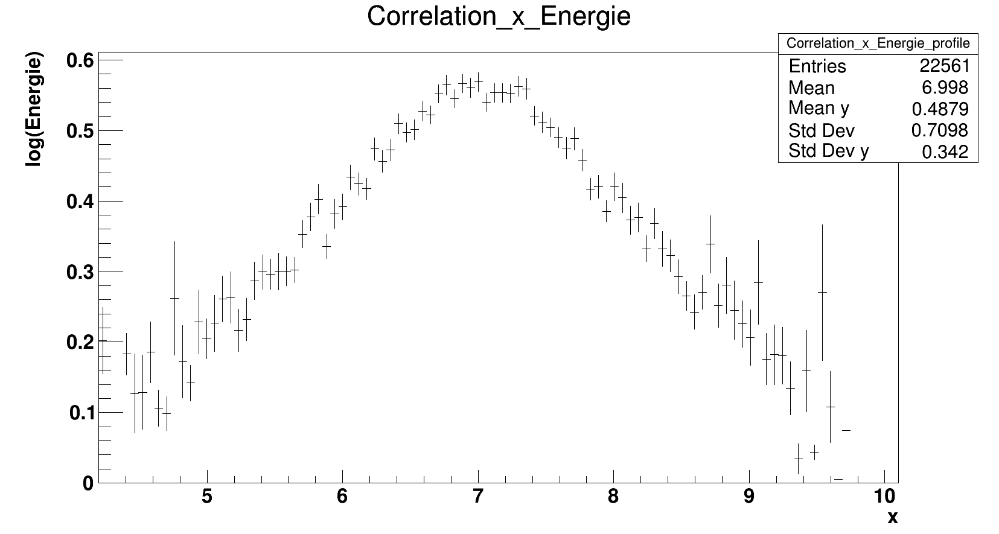
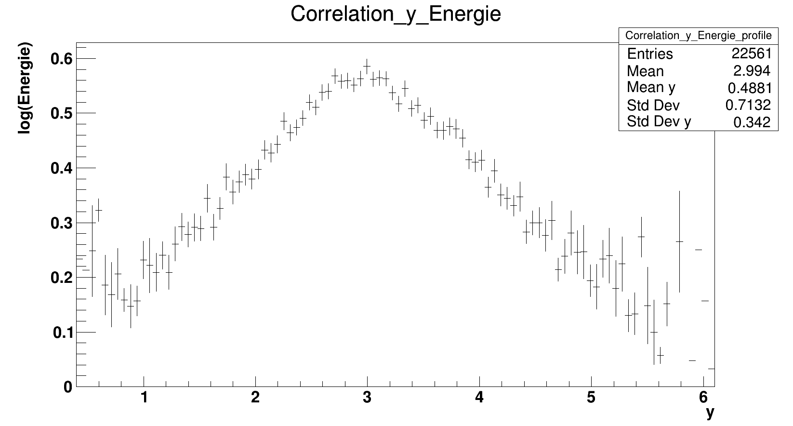
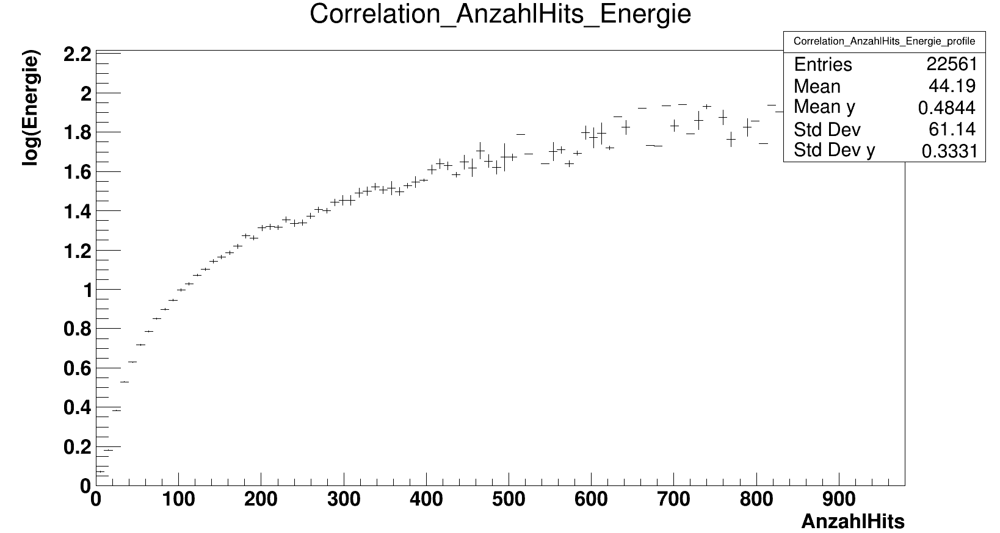

### a)
Baum durch Ausschlusskriterium ausgewählt.
    
    mode: test
    pseudo_data_fraction: 0.1

    source_file_moca: NeutrinoMC.root
    roottree_moca: Signal_MC_Akzeptanz

### b)
hohe Energien kommen deutlich seltener vor.

    branch_x: Energie log 
    limits_x: 0 2 #scheint schon in TeV zu sein

    number_bins: 8
    max_number_bins: 8

### c)
Willkürlich gebinned. `AnzahlHits` ist auch log-verteilt.

    branch_y: AnzahlHits log
    number_y_bins: 20 log #scheinbar muss man hier auch log-gen

    branch_y: x
    number_y_bins: 8

    branch_y: y
    number_y_bins: 8
    number_all_variables: 3

### d)

Geeignet sind alle Observablen, da sie eine Korrelation zur Energie aufweisen und untereinander kaum korreliert sind (Korrelationsplots zwischen den Observablen sind in guter Näherung konstante Funktionen). Indes bietet nur `AnzahlHits` eine monotone Korrelation, was eine Entfaltung leichter macht. Die anderen Observablen erlauben zwar in begrenzten Maße eine Vorhersage der Energie, lassen sich aber nicht durch unseren Begriff des Korrelationskoeffizient gebührend beschreibend. 

