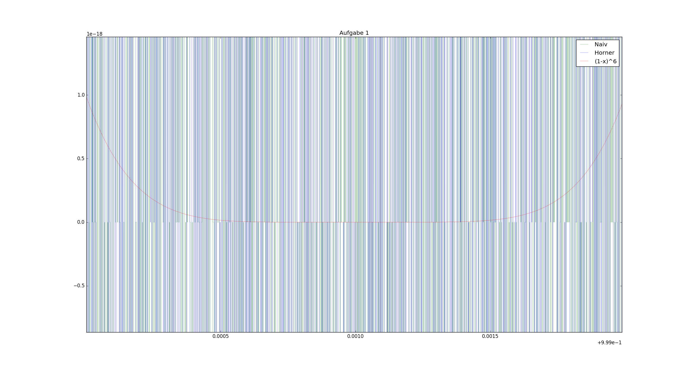
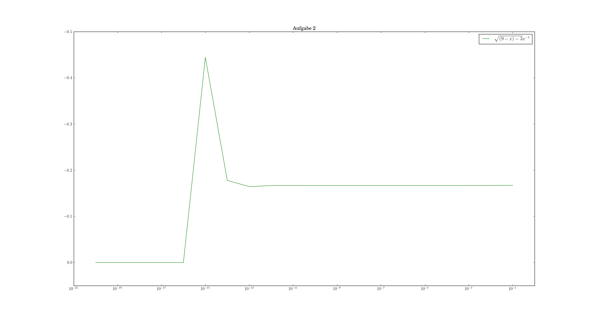

# Blatt 0

## Aufgabe 1

*a)* ist am genausten, da $(1-x)^6$ numerisch stabiler ist (eine Addition, sonst nur Multiplikationen). *b)* ist am schlechtesten konditioniert, da maximal oft addiert wird. *c)* liegt dazwischen, nahe Null treten trotzdem Probleme auf.

## Aufgabe 2
### a)
Nach *L'Hôpital* ergibt sich der Grenzwert zu $-1/6$.

### b)

Ab $<10^{-15}$ ist die `double`-Genauigkeit unterschritten; die Größenordnungen von 9 und $10^{-16}$ im Radikanten unterscheiden sich zu stark.

Davor treten Rundungsfehler beim Wurzelziehen auf, dies erklärt den *"Peak"* bei $10^{-15}$.

## Aufgabe 3
### a)

